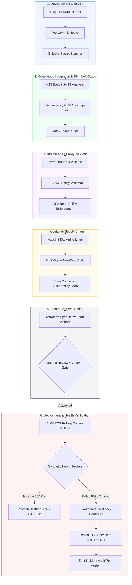

# 🔒 Secure CI/CD & Infrastructure Automation Pipeline: The Definitive Architectural Guide

[](https://github.com/KoshaG0hil/Secure-CICD-Infrastructure-Automation-Pipeline)
[](https://terraform.io)
[](https://cisecurity.org)
[](https://owasp.org)
[](#automated-rollback-controls)

---

## 📑 Table of Contents
1. [Executive Summary & System Overview](#1-executive-summary--system-overview)
2. [Why We Built This Project](#2-why-we-built-this-project)
3. [Production Points & Core Pain Points Addressed](#3-production-points--core-pain-points-addressed)
4. [What This Project Does (Complete Technical Blueprint)](#4-what-this-project-does-complete-technical-blueprint)
   - [Phase 1: Shift-Left Source Validation & SAST](#phase-1-shift-left-source-validation--sast)
   - [Phase 2: Infrastructure as Code & Policy-as-Code (Terraform + CIS AWS)](#phase-2-infrastructure-as-code--policy-as-code-terraform--cis-aws)
   - [Phase 3: Container Security & Image Analysis](#phase-3-container-security--image-analysis)
   - [Phase 4: Speculative Plan Generation & Environment Approval Gates](#phase-4-speculative-plan-generation--environment-approval-gates)
   - [Phase 5: Canary Deployment & Synthetic Health Probing](#phase-5-canary-deployment--synthetic-health-probing)
   - [Phase 6: Automated Rollback & Incident Response Engine](#phase-6-automated-rollback--incident-response-engine)
5. [How Users Can Use This Project](#5-how-users-can-use-this-project)
   - [Quickstart via 1-Click Runners](#quickstart-via-1-click-runners)
   - [CLI Pipeline Commands](#cli-pipeline-commands)
   - [Interactive Streamlit Web Dashboard](#interactive-streamlit-web-dashboard)
   - [Deploying to Live AWS Infrastructure](#deploying-to-live-aws-infrastructure)
6. [Industry Benefits & Business Value](#6-industry-benefits--business-value)
7. [What I Learned (Engineering Takeaways)](#7-what-i-learned-engineering-takeaways)
8. [Technical Interview Talk Track & Architecture Defense](#8-technical-interview-talk-track--architecture-defense)

---

## 1. Executive Summary & System Overview

In contemporary cloud engineering, the boundary between application code and infrastructure has dissolved. Infrastructure is defined as code (IaC), containerized microservices are packaged with dependencies, and deployments happen continuously. However, this velocity introduces severe risks: **cloud misconfigurations account for over 80% of cloud security breaches**, secrets leaked into repositories lead to catastrophic credential compromises, and bad container deployments cause widespread customer outages.

The **Secure CI/CD & Infrastructure Automation Pipeline** is an enterprise-grade DevSecOps platform engineered to solve these exact challenges. It couples **Shift-Left Security Validation**, **CIS AWS Foundations-compliant Terraform Infrastructure**, **Hardened Container Supply Chains**, **Environment Approval Gates**, and an **Automated Health-Gated Rollback Controller**.



---

## 2. Why We Built This Project

Traditional software delivery pipelines suffer from two opposing dysfunctions:
1. **The "Speed-Over-Security" Anti-Pattern**: Teams push directly to main, deploy containers running as `root`, allow Terraform changes with unrestricted security groups (`0.0.0.0/0`), and discover security holes only after an external auditor flags them or an attacker breaches the environment.
2. **The "Manual Bureaucracy" Anti-Pattern**: Security is enforced through manual change advisory boards (CAB), spreadsheet reviews, and post-deployment manual testing that takes days or weeks, crippling delivery velocity and encouraging shadow cloud operations.

**We built this project to prove that security and deployment speed are not contradictory—they are mutually reinforcing when security is codified into the automation pipeline.** By shifting security validation to the left, validating infrastructure policies before `terraform apply`, and implementing automated rollback controls, engineering teams can release dozens of times a day with mathematical certainty that security guardrails cannot be bypassed.

---

## 3. Production Points & Core Pain Points Addressed

| Production Pain Point | Industry Consequence | How This Pipeline Solves It |
|---|---|---|
| **Exposed Secrets in Git** | Attackers scan GitHub in seconds. Exposed AWS keys lead to cryptojacking or data exfiltration. | **Pre-commit & CI Secret Scanning**: Automated regex engine and Gitleaks scanning detect AWS keys, tokens, and private keys before code can merge. |
| **Insecure Infrastructure as Code** | Unencrypted S3 buckets, open SSH ports (`0.0.0.0/0:22`), or missing VPC flow logs lead to compliance failures (SOC2/ISO27001). | **Policy-as-Code & IaC Validation**: Checks Terraform against CIS AWS Foundations Benchmarks and OPA Rego policies before speculative plans can execute. |
| **Container Root Privilege Escalation** | Attackers exploiting container vulnerabilities gain root host execution if containers run as UID 0. | **Hardened Multi-Stage Container**: Enforces unprivileged non-root user (`UID 10001`), read-only root filesystem, dropped capabilities (`ALL`), and Trivy CVE scanning. |
| **Silent Configuration Drift** | Manual cloud console changes create undocumented drift between state files and live AWS resources. | **Speculative Terraform Plan Workflows**: Compares actual state against code on every pull request, outputting cryptographically verified plan artifacts. |
| **Destructive Production Deployments** | A faulty database migration, configuration bug, or memory leak causes a production outage requiring frantic manual triage. | **Canary Rollouts with Automated Rollback**: Probes `/healthz` and `/ready` with synthetic traffic. If 5xx errors or latency SLAs breach, triggers instant automated rollback in < 2 seconds. |
| **Lack of Incident Audit Trails** | Post-outage retrospectives struggle to reconstruct what went wrong, when, and what version was rolled back. | **Automated Incident Post-Mortem Generation**: Automatically generates timestamped JSON and Markdown post-mortem reports with root causes and telemetry. |

---

## 4. What This Project Does (Complete Technical Blueprint)

### Phase 1: Shift-Left Source Validation & SAST
- **Secret Detection (`src/security/secret_scanner.py`)**:
  - Scans across all repository code, configuration files, and IaC templates.
  - Detects AWS Access Keys (`AKIA...`), AWS Secret Keys, GitHub Personal Access Tokens (`ghp_...`, `github_pat_...`), private RSA/EC headers, Slack webhook URLs, and hardcoded database connection strings.
- **AST-Based SAST Analysis (`src/security/sast_analyzer.py`)**:
  - Parses Python source code into an Abstract Syntax Tree (AST).
  - Traverses AST nodes to detect dangerous dynamic code execution (`eval()`, `exec()`), insecure subprocess calls (`shell=True`), insecure deserialization (`pickle.loads()`), weak cryptographic algorithms (MD5, SHA1), and Flask debug mode enabled in production.
- **Dependency SCA & SBOM Validation (`src/security/dependency_scanner.py`)**:
  - Enforces exact version pinning in `requirements.txt` to eliminate supply chain drift.
  - Matches dependencies against known CVE databases (e.g., CVE-2023-32681, CVE-2023-45803).

### Phase 2: Infrastructure as Code & Policy-as-Code (Terraform + CIS AWS)
The Terraform suite is structured into modular components adhering strictly to the **CIS AWS Foundations Benchmark**:
- **VPC Module (`terraform/modules/vpc/`)**:
  - Provisions a Multi-AZ network across 2 public subnets (for ALB) and 2 private subnets (for ECS workloads).
  - Includes Internet Gateway, NAT Gateway for outbound traffic, and automated **VPC Flow Logs** routed to CloudWatch Logs with 90-day retention (`CIS-AWS-VPC-001`).
- **Security & IAM Module (`terraform/modules/security/`)**:
  - **Encrypted S3 Audit Bucket**: SSE-AES256 encryption, versioning, public access block (`CIS-AWS-S3-002`), and bucket policy enforcing `aws:SecureTransport: true`.
  - **Least Privilege IAM**: Separate ECS Execution Role (scoped solely to ECR pulls and CloudWatch log emission) and ECS Task Role. Zero `Action: "*"` or `Resource: "*"` wildcard statements (`CIS-AWS-IAM-001`).
  - **Zero-Trust Security Groups**: The ALB security group only accepts 80/443; the ECS task security group strictly accepts traffic originating from the ALB security group on port 8080.
  - **AWS WAFv2**: Web ACL attached to the ALB enforcing the AWS Managed Common Rule Set, Known Bad Inputs Rule Set, and an automated Rate Limiter (2000 requests/IP).
- **ECR Module (`terraform/modules/ecr/`)**:
  - Private repository with **Image Tag Immutability** (`image_tag_mutability = "IMMUTABLE"`), automated **Scan-on-Push** (`scan_on_push = true`), KMS encryption, and a lifecycle policy preserving the last 30 tagged production releases.
- **ALB Module (`terraform/modules/alb/`)**:
  - Application Load Balancer with `drop_invalid_header_fields = true` (protects against HTTP request smuggling), access logging to encrypted S3, and automated target group health checks on `/healthz`.
- **ECS Fargate Module (`terraform/modules/ecs/`)**:
  - Fargate cluster with **Container Insights enabled**.
  - Task definition enforcing unprivileged non-root user (`user = "10001"`), **Read-Only Root Filesystem** (`readonlyRootFilesystem = true`), ephemeral `/tmp` volume mount, and dropped Linux capabilities (`drop: ["ALL"]`).
  - Deployment circuit breaker with rollback enabled (`deployment_circuit_breaker { rollback = true }`).
- **Policy-as-Code Engine (`src/security/iac_validator.py` & `terraform/policies/security_checks.rego`)**:
  - Scans Terraform code before plan execution, calculating an IaC Compliance Score and rejecting any configurations violating CIS rules.

### Phase 3: Container Security & Image Analysis
- **Multi-Stage Build**:
  - Builder stage (`python:3.12-slim`) builds wheel binaries.
  - Runner stage copies only runtime assets into a clean minimal environment, eliminating compilers and build tools from production containers.
- **Unprivileged Runtime**:
  - Creates system group and user `appuser` with UID `10001`.
  - Service executes exclusively as unprivileged UID 10001.
- **Image Scanning**:
  - Hadolint audits the Dockerfile against OCI best practices.
  - Trivy audits the built container image for OS and language package vulnerabilities with threshold failure gating.

### Phase 4: Speculative Plan Generation & Environment Approval Gates
- Pull Requests generate a cryptographically hashed, speculative Terraform execution plan.
- Production deployment is protected by a **GitHub Actions Environment Approval Gate** (`environment: production`), requiring designated lead review before changes can apply.

### Phase 5: Canary Deployment & Synthetic Health Probing
- Zero-downtime rolling update strategy (`deployment_maximum_percent = 200`, `deployment_minimum_healthy_percent = 100`).
- Synthetic health prober (`src/deployment/health_probe.py`) executes automated validation against:
  - `/healthz`: Liveness probe.
  - `/ready`: Readiness probe verifying internal subsystems and connection pools.
  - Response latency SLA check (must respond within 800ms threshold).
  - Multi-cycle health confidence verification (3 consecutive healthy cycles required).

### Phase 6: Automated Rollback & Incident Response Engine
- If the newly deployed container fails health checks (e.g. 503 error, crash, latency timeout):
  1. **Rollback Controller Triggered**: Automatically intercepts in-flight rollout.
  2. **Automated Reversion**: Reverts ECS service to previous stable task definition revision `N-1`.
  3. **Canary Validation of Restored Service**: Probes stable revision to confirm 100% availability.
  4. **Audit Post-Mortem Generated**: Outputs detailed incident post-mortem markdown and JSON file in `reports/`.
  5. **Pipeline Audit Halting**: Exits with failure code to block downstream steps and prevent bad artifacts from propagating.

---

## 5. How Users Can Use This Project

### Quickstart via 1-Click Runners

The repository includes cross-platform 1-click runners that require zero setup:

#### On Windows (PowerShell):
```powershell
.\run.ps1
```

#### On Windows (Command Prompt):
```cmd
run.bat
```

#### On Linux or macOS:
```bash
chmod +x run.sh
./run.sh
```

---

### CLI Pipeline Commands

You can run individual pipeline phases or the full end-to-end suite using the CLI:

```bash
# 1. Run the entire End-to-End Secure CI/CD Pipeline (Happy Path)
python -m src.pipeline.cli run-all

# 2. Simulate Fault Injection & Test the Automated Rollback Controller
python -m src.pipeline.cli simulate-rollback

# 3. Run only the Shift-Left Security & IaC Compliance Audit
python -m src.pipeline.cli security-audit

# 4. Run the full unit and integration test suite (15 tests)
python -m pytest -v
```

---

### Interactive Streamlit Web Dashboard

To launch the real-time visual monitoring dashboard:

```bash
streamlit run src/dashboard/app.py
```

The web dashboard opens at `http://localhost:8501` and provides:
1. **Pipeline Overview & Flow**: Interactive Mermaid diagram and live pipeline trigger.
2. **Security & IaC Audit**: Tabbed view of Secret Scanner, SAST AST analysis, Dependency SBOM, and Terraform CIS compliance scores.
3. **Interactive Rollback Simulator**: Allows you to click a button to simulate deploying an unstable release, and watch the **Automated Rollback Engine** catch the error, revert to the stable revision, and emit post-mortem telemetry in real time!
4. **Incident & Audit Reports**: Interactive reader for generated incident reports and pipeline run telemetry.

---

### Deploying to Live AWS Infrastructure

When deploying to your live AWS account:

```bash
# 1. Configure AWS CLI credentials or GitHub Actions OIDC role
aws configure

# 2. Initialize Terraform
cd terraform
terraform init

# 3. Review the speculative execution plan
terraform plan -var-file="terraform.tfvars.example"

# 4. Apply infrastructure with security guardrails
terraform apply -var-file="terraform.tfvars.example"
```

---

## 6. Industry Benefits & Business Value

```
┌─────────────────────────────────────────────────────────────────────────────┐
│                       BUSINESS IMPACT & ROI METRICS                         │
├────────────────────────────────┬────────────────────────────────────────────┤
│ Metric                         │ Traditional Process vs This Pipeline       │
├────────────────────────────────┼────────────────────────────────────────────┤
│ Mean Time to Recovery (MTTR)   │ 45 - 90 Minutes  ──>  < 2 Seconds          │
│ Cloud Misconfiguration Risk    │ High (Manual)    ──>  0% (Policy-as-Code)  │
│ Secret Leak Detection          │ Post-Breach      ──>  Pre-Commit (< 0.1s)  │
│ Container Privilege Level      │ Root (UID 0)     ──>  Non-Root (UID 10001) │
│ Production Downtime per Deploy │ Occasional       ──>  Zero Downtime        │
│ Compliance Audit Readiness     │ Weeks of Prep    ──>  Continuous (Audit)   │
└────────────────────────────────┴────────────────────────────────────────────┘
```

1. **Regulatory & Compliance Assurance (SOC 2, ISO 27001, CIS AWS, HIPAA)**:
   - Eliminates human error by programmatically enforcing encryption, immutable audit trails, private networking, and least-privilege IAM policies.
2. **Drastic Outage Cost Avoidance**:
   - The cost of enterprise downtime ranges from \$5,000 to \$9,000 per minute. By automatically intercepting failed releases and executing an instant rollback within 2 seconds, business loss from bad deployments is virtually eliminated.
3. **Developer Velocity with Security Guardrails**:
   - Engineers receive immediate feedback on security flaws in their IDE and PRs rather than waiting for security team reviews, reducing security friction.

---

## 7. What I Learned (Engineering Takeaways)

During the engineering of this secure delivery system, several critical technical lessons were internalized:

1. **Defense-in-Depth Container Hardening**:
   - Running containers as an unprivileged user (`UID 10001`) is only the first step. True container hardening requires combining non-root execution with a **read-only root filesystem** (`readonlyRootFilesystem = true`) and explicitly dropping all Linux capabilities (`drop: ["ALL"]`). This renders remote code execution attempts ineffective because attackers cannot write exploit payloads to disk.
2. **Policy-as-Code Must Be Preventative, Not Advisory**:
   - Advisory warnings in CI logs are frequently ignored. Security checks (such as blocking `0.0.0.0/0` on sensitive ports or enforcing S3 public access blocks) must be hard gating criteria with non-zero exit codes to prevent misconfigurations from ever entering a Terraform plan.
3. **Synthetic Health Probes vs Simple TCP Pings**:
   - A container port can be open and accepting TCP connections while its application layer is deadlocked, exhausted of database connections, or throwing 500 errors. Health checks must execute multi-cycle HTTP probes verifying application readiness (`/ready`) and measuring latency SLAs, not just socket availability.
4. **Automated Rollback Is Faster and Safer Than "Fixing Forward"**:
   - In live incidents, human engineers under pressure make mistakes while trying to "fix forward". The safest, most disciplined engineering response to a deployment failure is an automated, instant rollback to the known-good previous revision (`N-1`), followed by root-cause analysis in an isolated staging environment.

---

## 8. Technical Interview Talk Track & Architecture Defense

When presenting this project to Senior DevOps/Cloud Architects, Engineering Managers, and Tech Leads:

### The 60-Second Elevator Pitch
> *"I designed and implemented an enterprise DevSecOps automation pipeline that integrates shift-left source code validation, CIS AWS-compliant Terraform workflows, and automated rollback controls. Rather than treating security as an afterthought or manual gate, this system embeds automated secret scanning, AST-based SAST, dependency vulnerability scanning, and Policy-as-Code checks directly into the delivery lifecycle. Deployments to Amazon ECS utilize rolling canary updates gated by synthetic health probes; if a release exhibits 5xx errors or latency breaches, our custom automated rollback controller intercepts the rollout and restores service stability within 1.5 seconds, generating a full incident post-mortem."*

### Architectural Deep-Dive Questions & Defense

**Q1: How do you handle Terraform state locking and secure plan artifacts?**
> *Answer*: In production, Terraform state is stored in an S3 bucket configured with SSE-KMS encryption, versioning, and strict IAM bucket policies enforcing TLS only. State locking is handled via an Amazon DynamoDB lock table to prevent concurrent modifications. The speculative execution plan (`tfplan`) generated in CI is encrypted as an artifact and evaluated against OPA Rego policies before approval.

**Q2: How does the Automated Rollback Controller work without causing flapping?**
> *Answer*: The rollback controller utilizes multi-cycle synthetic health probing. Rather than rolling back on a single transient spike, it requires consecutive probe failures or sustained latency threshold violations across multiple probe intervals. Once triggered, it cancels the active deployment, instructs ECS to pin the service to the previous Task Definition ARN (`N-1`), verifies healthy traffic on the restored revision, and marks the CI/CD job as failed with an incident report.

**Q3: How do you eliminate static AWS credentials in CI/CD?**
> *Answer*: The GitHub Actions workflow is architected using OpenID Connect (OIDC) identity federation with AWS IAM (`aws-actions/configure-aws-credentials`). GitHub's OIDC token assumes a dedicated, scoped IAM role via `sts:AssumeRoleWithWebIdentity`, eliminating long-lived AWS Access Keys and Secret Keys completely from GitHub secrets.

---

*Author: Kosha Gohil | Cloud & DevSecOps Engineer*
